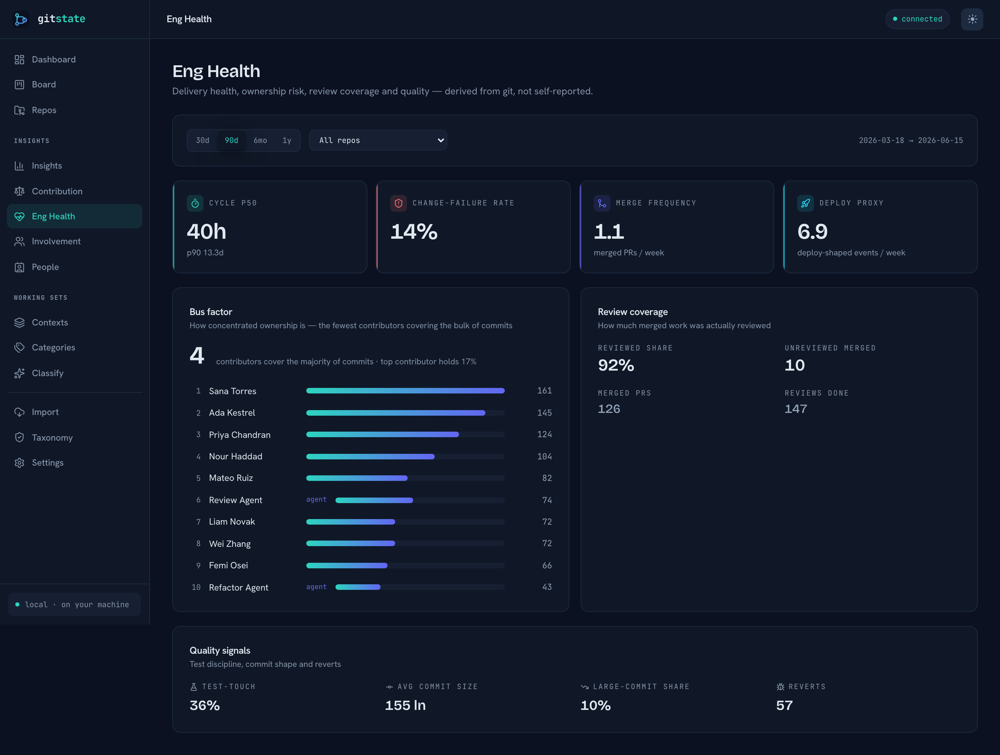
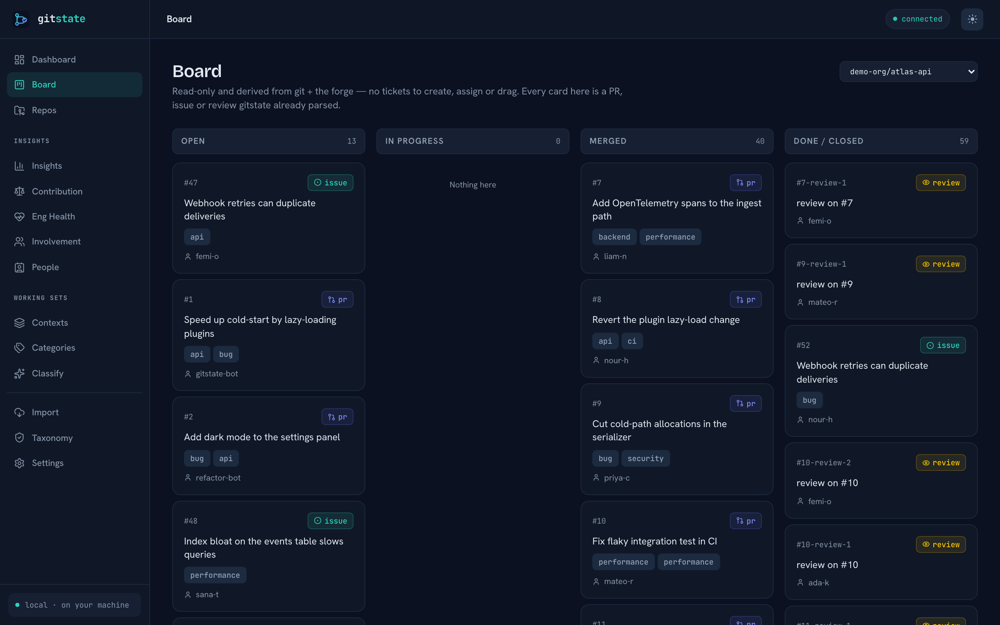
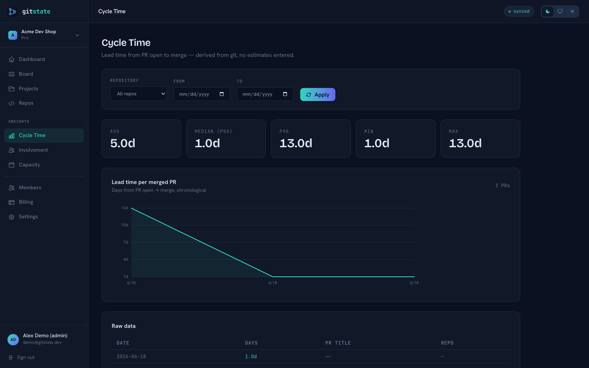
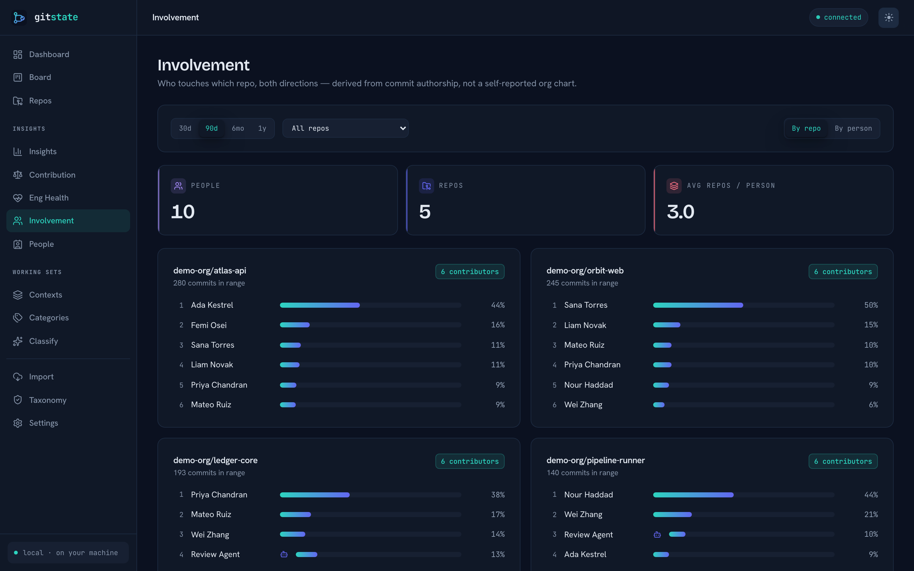
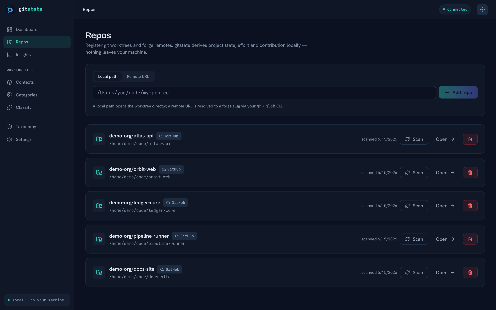
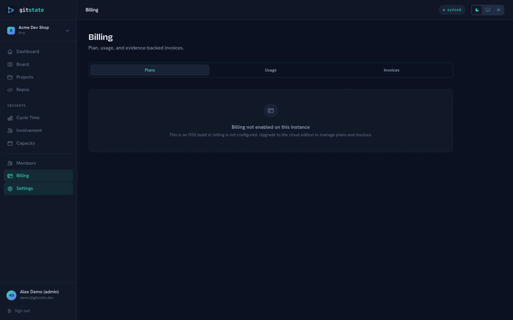
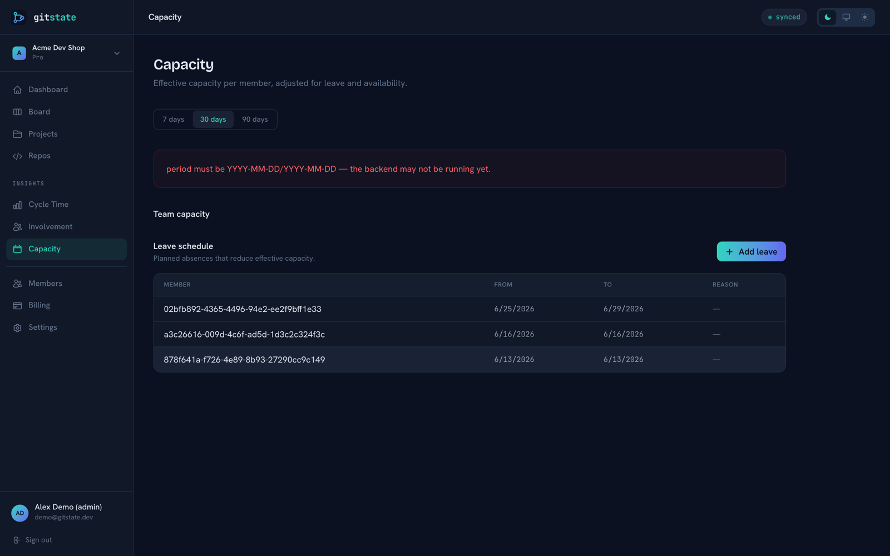
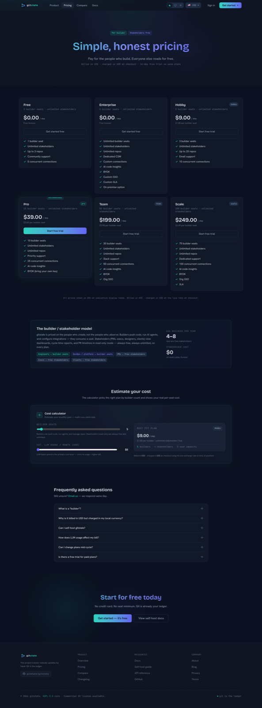
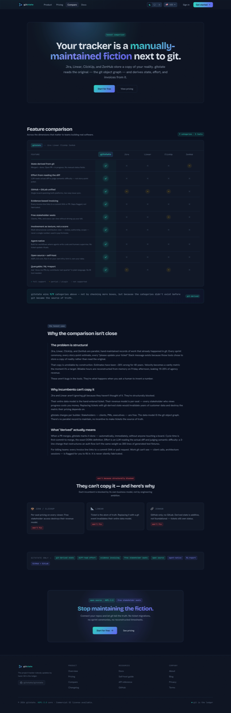

<div align="center">


# gitstate

### The project tracker nobody updates by hand.

gitstate reads your repositories and **derives** true project state, effort, and — for billing teams —
the invoice, directly from git. Built for a world where agents write the code and humans supervise.

<br>

[](./LICENSE)
[](./ee/LICENSE)
[](https://go.dev)
[](https://react.dev)
[](https://www.postgresql.org)
[](https://vitejs.dev)
[](./CONTRIBUTING.md)

<br>



</div>

---

## Why it exists

Every current tool — Jira, Linear, ClickUp, ZenHub — is a **manually-maintained fiction** sitting next
to git. People re-type into tickets what they already did in the repo. The result is unreliable *by
construction*:

- **Estimates** are off by ~30% on average — and have been for **40 years**.
- **Velocity** becomes a vanity metric the moment it's a target (Goodhart's Law); points get inflated.
- **Billable hours** are reconstructed from memory on Friday, leaking 15–25% of revenue.

These aren't bugs in the tools. They're what happens when you ask a human to *invent* a number.
**Git is the real ledger.** gitstate stops asking — it observes work from git — and makes whatever
fiction remains *explicit*.

### Five disciplines constrain everything

> If a feature would force a human to invent a number, it doesn't ship.

| Discipline | What it means |
|---|---|
| **Derived, not entered** | State comes from git — merged = done, PR open = in progress. Nobody maintains tickets. |
| **Measure work, not workers** | Contribution is shown as *texture across dimensions* (including review), never a single score, never a bonus formula. |
| **Evidence-based, gaps visible** | Effort and billing are backed by git; what git can't see (meetings, research) is *flagged for a human to fill*, never invented. |
| **Free stakeholders** | Billing is per *builder*; clients and viewers are free. |
| **Agent-native** | Agent runs are first-class units; humans are the oversight layer. |

The full rationale lives in [`decisions.md`](./decisions.md) and the in-app [The Wedge](internal/docs/content/the-wedge.md) doc.

---

## Capabilities

|  |  |
|---|---|
|  |  |
| **Dashboard — state derived from git.** Project status, cycle time, and burndown computed from the repo, not typed into a ticket. | **Board — two truth-modes, one board.** Dev work is *derived* from git (merged = done); non-dev work is tracked manually — shown honestly, never blended. |
|  |  |
| **Cycle time — DORA lead times.** First-commit-to-merge *is* the cycle time. No story-point inputs as the source of truth. | **Involvement — texture, not a score.** Contribution across dimensions (features, review load, ownership, spread) so seniors and mentors aren't zeroed. Never a ranking. |
|  |  |
| **Repos — GitHub + GitLab.** Two-way issue/PR sync into one unified board, with **auto-progress**: open PR → in progress, merged PR → done. | **Billing (EE) — evidence invoices.** Backed by git activity; gaps git can't see are flagged for a human to confirm. Billed in **USD**, charged in **ZAR** at capture-time FX. |

<details>
<summary><b>More: capacity, members, repos, pricing & compare</b></summary>

<br>

| Capacity & PTO | Members |
|---|---|
|  |  |
| Availability-aware planning: capacity = availability − approved leave. | Roles incl. free **stakeholder** seats; org-scoped via row-level security. |

| Pricing | Compare |
|---|---|
|  |  |
| Per-builder, currency-aware plan ladder (Free → Enterprise). | The structural difference vs. the hand-entered incumbents. |

</details>

**Also inside:** LLM **diff-difficulty** sizing (judges the *change*, not line counts) · **NL → report**
(natural-language queries over a SELECT-only, RLS-safe path) · agent-run tracking · server-rendered
super-admin console (HTML + htmx + realtime SSE, every cross-org access audited).

---

## Architecture

A single Go binary plus a React frontend, backed by Postgres with row-level security for tenant isolation.

| Layer | Tech | Notes |
|---|---|---|
| **Backend** | Go 1.25, single static binary | Great concurrency for repo sync + LLM fan-out; cheap to run |
| **Frontend** | React 19 + Vite + Tailwind (JSX, no TSX) | Standalone in dev, embedded in the binary for prod |
| **Admin** | Server-rendered HTML (`html/template` + htmx + SSE) | The super-admin "super pages"; not part of the SPA |
| **Database** | Postgres (Neon) | **Row-level security** enforces multi-tenant isolation |
| **Auth** | Internal JWT + rotating refresh | Optional Google / Microsoft OAuth (config-gated) |
| **Data access** | pgx + hand-written SQL (no heavy ORM) | Predictable, queryable, reviewable |
| **Billing (EE)** | Paystack | Billed in USD, charged in ZAR at capture-time FX |
| **Deploy** | fly.io primary; Docker, compose, systemd, bare binary | No lock-in |

**Open core + Enterprise, one repo (GitLab model).** The core is AGPL-3.0. The `ee/` directory
(Paystack billing, cross-org admin) compiles only with `-tags ee`; the default OSS build links no-op
stubs in its place and is fully self-hostable. Full package map: [`internal/docs/content/architecture.md`](internal/docs/content/architecture.md).

```
Recoverer → Logger → RateLimit(300/min/IP) → CORS → AuthContext → mux
```

Org-scoped routes additionally wrap `RequireAuth` → `OrgScope` (active org from the `X-Org-ID` header)
and run reads inside `db.WithOrg(ctx, orgID, fn)`, which opens a tx and runs `SET LOCAL app.current_org`
before any query — so isolation is enforced by the **database**, not just app code (proven by
`internal/store/rls_test.go`).

---

## Quickstart

**Prerequisites:** Go 1.25+, Node 20+, a Postgres database (local or [Neon](https://neon.com)), and
`git` on the `PATH` (the git engine shells out to it).

```bash
git clone <repo> gitstate && cd gitstate

# 1. Configure — one shared env for backend + frontend
cp .env.example .env.dev          # point DATABASE_URL at your Postgres; set JWT_SIGNING_KEY etc.

# 2. Database (forward-only migrations) + an optional demo org
go run ./cmd/migrate up
go run ./cmd/seed                 # demo login: demo@gitstate.dev / demo1234

# 3. Run everything (Go API on :8080 + Vite on :5173)
cd web && npm install && npm run dev:full
```

Open **http://localhost:5173** and sign in.

> One `.env.dev` holds both backend secrets (unprefixed) and frontend-public vars (`VITE_*`); Vite only
> ever exposes the `VITE_` half. Set `ANTHROPIC_API_KEY` to enable LLM diff-difficulty and NL→report.

### Single binary / Docker / fly

```bash
make build         # build the web app, embed it, build the OSS binary  → ./gitstate (API + UI on :8080)
make build-ee      # Enterprise Edition (Paystack billing + cross-org admin, -tags ee)
docker compose up  # app (+ optional local Postgres via the `local-db` profile)
# fly.io: see deploy/fly.toml
```

---

## Docs

The docs ship **in the app** at [`/docs`](http://localhost:5173/docs) and live as markdown in
[`internal/docs/content/`](internal/docs/content/). Start here:

- [Overview](internal/docs/content/overview.md) · [The Wedge](internal/docs/content/the-wedge.md) · [Concepts](internal/docs/content/concepts.md)
- [Quickstart](internal/docs/content/quickstart.md) · [Self-hosting](internal/docs/content/self-hosting.md) · [Configuration](internal/docs/content/configuration.md)
- [Connecting repos](internal/docs/content/connecting-repos.md) · [Derived state](internal/docs/content/derived-state.md) · [Effort & estimation](internal/docs/content/effort-and-estimation.md)
- [Metrics & reporting](internal/docs/content/metrics-and-reporting.md) · [Capacity & planning](internal/docs/content/capacity-and-planning.md) · [Billing](internal/docs/content/billing.md)
- [Architecture](internal/docs/content/architecture.md) · [Security](internal/docs/content/security.md) · [API reference](internal/docs/content/api-reference.md) · [CLI & tools](internal/docs/content/cli-and-tools.md) · [FAQ](internal/docs/content/faq.md)

---

## Migrations

Forward-only, Supabase-style — `migrations/YYYYMMDD_NNN_name.sql` (no up/down; a rollback is a new
forward migration). Checksums detect edited-after-apply.

```bash
go run ./cmd/migrate new <name>   # scaffold
go run ./cmd/migrate up           # apply pending
go run ./cmd/migrate status       # applied + pending
go run ./cmd/migrate reset        # drop & re-apply (dev only; refused on prod)
```

---

## Billing viability

`go run ./cmd/billsim` simulates the pricing model (cohorts, conversion, churn, FX, LLM COGS) and
prints a profitability table. Headline at defaults:

| Cohort | Gross margin |
|---|---|
| 100 orgs | **−34%** (loss-making) |
| 1,000 orgs | **+56.6%** |
| 10,000 orgs | **+60.5%** |

**LLM inference cost is the decisive lever** — the simulator flags any tier it pushes underwater.

---

## Project status — an honesty note

gitstate is an ambitious, **agent-built** codebase (orchestrated build, parallel agents on disjoint
packages; see [`PROGRESS.md`](./PROGRESS.md)). What's solid:

- ✅ Both build tags compile (`go build ./...` and `go build -tags ee ./...`), `go vet` + tests pass.
- ✅ The web app builds and lints; the single binary serves the embedded SPA.
- ✅ Runs against **real Postgres**; **RLS is tested** (cross-org reads return zero rows).
- ✅ `migrate`, `seed`, and `billsim` run; the demo org boots end-to-end.

What it is **not**: production-hardened out of the box. Going live needs real credentials (DB, JWT
signing key, OAuth/Paystack/LLM keys), and a security and code review pass appropriate to your risk.

---

## License & contributing

- Everything outside `ee/` — **AGPL-3.0** (see [`LICENSE`](./LICENSE)).
- `ee/` (Enterprise Edition: Paystack billing, cross-org admin) — **commercial** (see [`ee/LICENSE`](./ee/LICENSE)).

Want to hack on it? See [`CONTRIBUTING.md`](./CONTRIBUTING.md). Found a vulnerability? See
[`SECURITY.md`](./SECURITY.md) and the [security model](internal/docs/content/security.md).

<div align="center"><sub>Git is the real ledger. Stop typing it twice.</sub></div>
