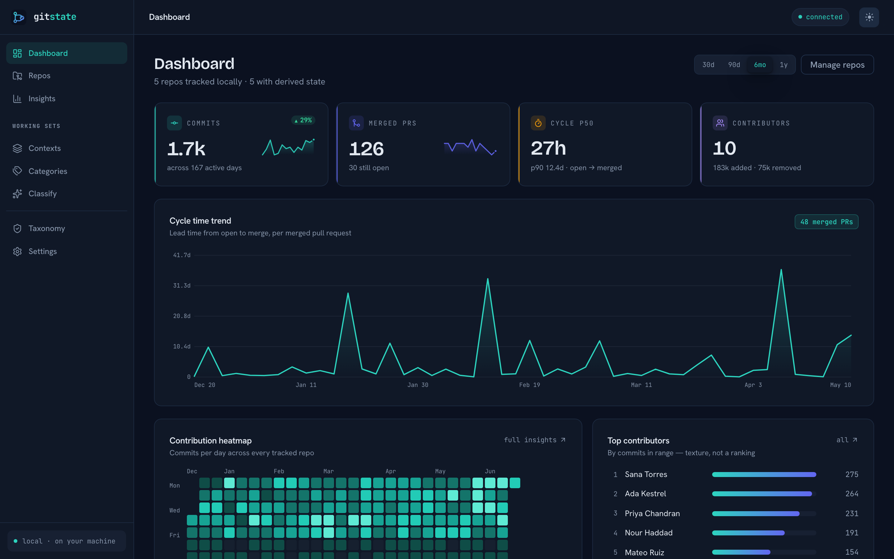
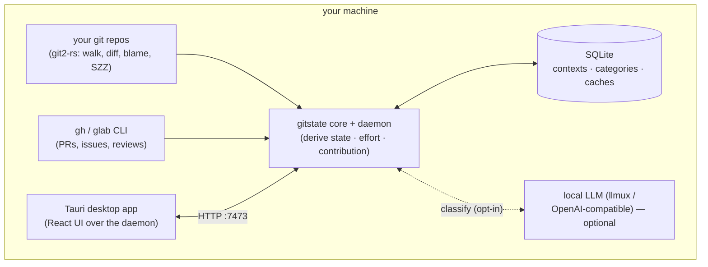
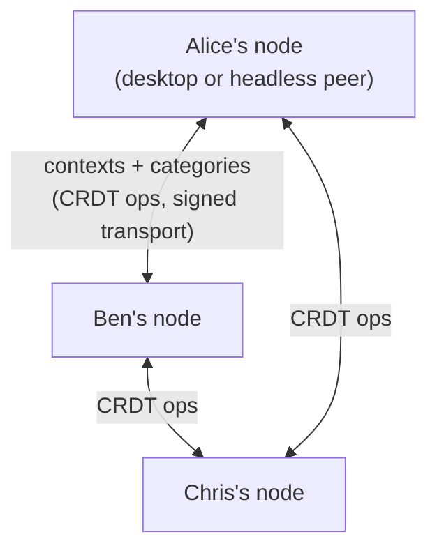
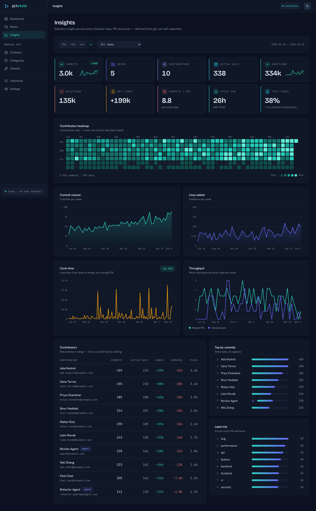
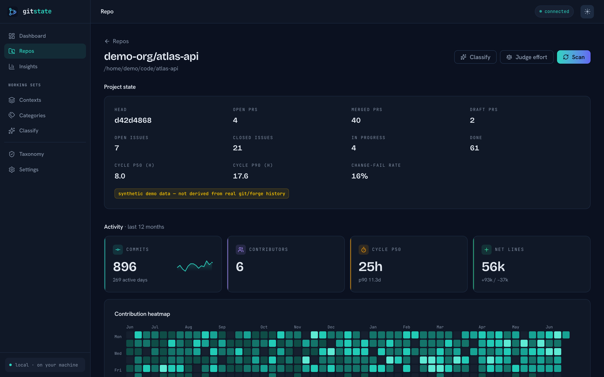
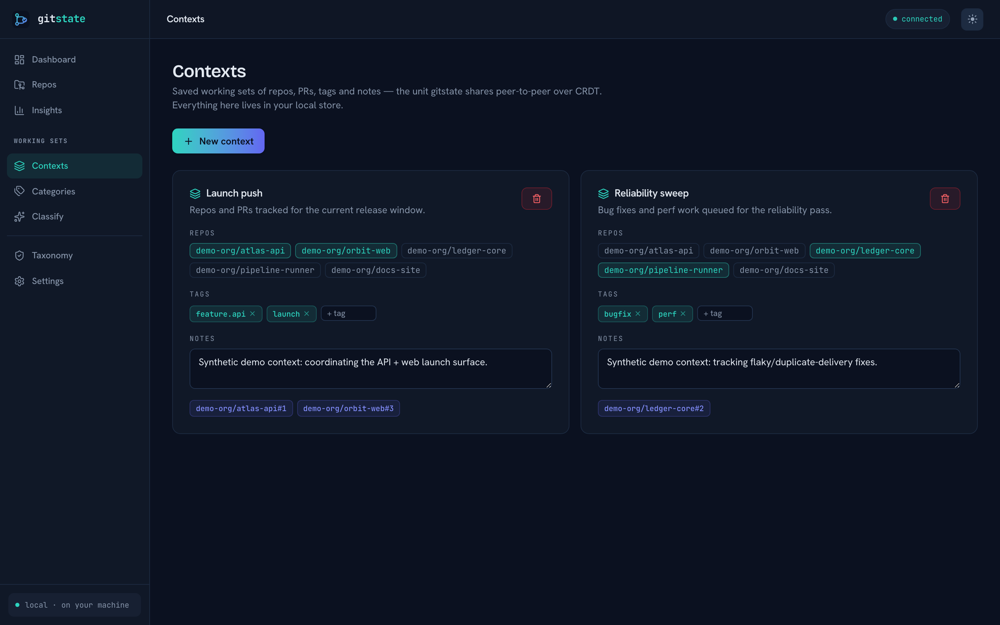
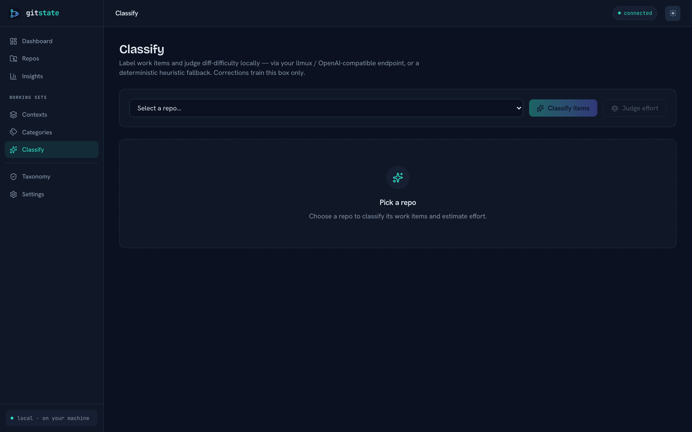

<div align="center">

<picture>
  <source media="(prefers-color-scheme: dark)" srcset="assets/logo-dark.svg">
  
</picture>

# gitstate

### Derive true project state from YOUR git — on your own machine.

gitstate reads your repositories and **derives** project state, effort, contribution, and
classification directly from git and your forge. No tickets to maintain, no numbers to invent.
It runs **locally**: a Rust core over plain SQLite, wrapped in a Tauri desktop app — no SaaS
backend, no multi-tenant server, no cloud account. What you run is what you own.

<br>

<!-- Plain-text badges on purpose: rendering this README triggers no external
     image fetches — the same no-default-network-calls ethos as the app. -->
<sub>
<a href="LICENSE-MIT">MIT</a> OR <a href="LICENSE-APACHE">Apache-2.0</a>
&nbsp;·&nbsp; Rust 1.85+
&nbsp;·&nbsp; Tauri 2
&nbsp;·&nbsp; React + Vite
&nbsp;·&nbsp; SQLite
&nbsp;·&nbsp; local-first
&nbsp;·&nbsp; P2P (CRDT)
&nbsp;·&nbsp; no cloud
</sub>

<br><br>

[Quick start](#quick-start) ·
[What it is](#what-is-gitstate) ·
[How it works](#how-it-works) ·
[Screenshots](#screenshots) ·
[Architecture](#architecture) ·
[Classification &amp; decentralization](#classification--decentralization) ·
[Docs](docs/) ·
[Roadmap](ROADMAP.md)

<br>



</div>

---

## What is gitstate?

Every project-tracking tool — Jira, Linear, ClickUp, ZenHub — is a **manually-maintained fiction**
sitting next to git. People re-type into tickets what they already did in the repo. The result is
unreliable *by construction*: estimates are off ~30% (and have been for 40 years), velocity is gamed
the moment it's a target, and timesheets are reconstructed from memory on Friday.

**Git is the real ledger.** gitstate stops asking humans to invent numbers — it observes work from
git and the forge — and makes whatever fiction remains *explicit*.

The difference from the old gitstate (and from every incumbent): **there is no central server.** A
Rust core over a plain SQLite file, wrapped in a Tauri desktop app. No account, no cloud, no
telemetry. It talks to GitHub/GitLab from **your** machine using **your** `gh`/`glab` login,
classifies with **your** local LLM (or a deterministic fallback), stores everything in a local
database, and shares saved working sets and categories **peer-to-peer** — never through a hub.

### Three disciplines constrain everything

> If a feature would force a human to invent a number, it doesn't ship.

| Discipline | What it means |
|---|---|
| **Derived, not entered** | State comes from git — merged = done, PR open = in progress. Nobody maintains tickets. |
| **Measure work, not workers** | Contribution is shown as *texture across six dimensions* (including review), never a single rank, never a bonus formula. |
| **Evidence-based, gaps visible** | Effort comes from an LLM reading the *shape* of a change (difficulty, not line count); what git can't see is flagged, never invented. |

### The six dimensions

Contribution is derived as six normalized dimensions — the gitstate essence — computed within the
repo cohort so seniors, reviewers, and maintainers are never zeroed:

| Dimension | Derived from |
|---|---|
| **Shipped** | merged PRs, closed issues |
| **Review** | reviews performed on others' work |
| **Effort** | Σ judged diff-difficulty (LLM reads the change; falls back to a deterministic heuristic) |
| **Quality** | inverted from reverts caused, bug introductions (SZZ), and cycle time |
| **Ownership** | areas of the codebase authored/maintained |
| **Durability** | surviving lines ÷ authored lines (git blame) |

Agent identities (Claude Code, Dependabot, …) are **first-class**: every contribution carries an
`agent_pct`, so autonomous work is counted honestly rather than hidden. The composite is a *texture
value*, displayed as evidence — never a leaderboard.

---

## How it works

Everything runs on your machine. The only network endpoints in the picture are ones **you**
configured — your forge (`gh`/`glab` or a token) and, optionally, your local LLM. A plain scan of a
local repo makes **zero** network calls.



The desktop app and the headless daemon serve the **same** JSON API — the Tauri shell just boots the
daemon in-process on a local port and points the React UI at it. Run it headless (`gitstate serve`)
as an always-on peer, or as a desktop app; same core either way.

Between machines there is no hub. The only things that cross the network are **saved contexts** (a
working set of repos, PRs, notes, tags) and **categories**, synced **peer-to-peer as CRDTs** — so two
peers converge with no authority in the middle. Your commits, diffs, and code never leave your box.



---

## Screenshots

<table>
<tr>
<td width="50%"><br><sub><em>Insights — a year of delivery, derived from git rather than self-reported</em></sub></td>
<td width="50%"><br><sub><em>Repo detail — project state, activity and the six gaming-resistant dimensions</em></sub></td>
</tr>
<tr>
<td width="50%"><br><sub><em>Contexts — saved working sets that sync peer-to-peer over CRDT</em></sub></td>
<td width="50%"><br><sub><em>Classify — work items labeled locally, heuristic fallback shown here</em></sub></td>
</tr>
</table>

<sub>All shots are the real desktop app against a deterministic synthetic demo dataset (`gitstate seed --demo`) — a fake org, fake pseudonymous contributors, never real git/forge history. See <a href="docs/screenshots/">docs/screenshots/</a> for the full set (including <a href="docs/screenshots/categories.png">Categories</a>, <a href="docs/screenshots/repos.png">Repos</a> and <a href="docs/screenshots/dashboard-light.png">light-mode</a> shots) and <code>web/scripts/screenshots.mjs</code> to regenerate.</sub>

---

## Quick start

> **Status: transform in progress.** gitstate is being rebuilt from a multi-tenant Go+Postgres SaaS
> into this standalone local-first desktop app. The Rust workspace (`crates/*`), the Tauri shell
> (`apps/desktop`), and the repointed React UI (`web/`) are landing now; the legacy Go server under
> `internal/` and `cmd/` is **kept in-tree, untouched**, for a staged port (see
> [docs/MIGRATION-NOTES.md](docs/MIGRATION-NOTES.md)). Check [PROGRESS.md](PROGRESS.md) for what is
> wired today.

### Prerequisites

- **Rust** stable (1.85+) and **Node** 20+ (for the desktop/web build).
- **`gh`** and/or **`glab`** on your `PATH`, logged in (`gh auth login`) — or a forge token in the
  environment (`GITSTATE_GH_TOKEN` / `GH_TOKEN`, `GITSTATE_GLAB_TOKEN` / `GITLAB_TOKEN`). No forge
  login is needed to scan a purely local repo.
- *(Optional)* a local LLM endpoint for classification and effort judging
  (`VULOS_LLMUX_URL` or `OPENAI_BASE_URL`). With none configured, gitstate uses a deterministic
  heuristic — everything still works, offline.

### Build from source

```bash
git clone https://github.com/vul-os/gitstate
cd gitstate

# Core library + CLI + headless daemon (no P2P deps pulled in)
cargo build --workspace
cargo run -p gitstate-cli -- --help

# Desktop app (starts the daemon in-process, loads the React UI)
cd apps/desktop && npm install && npm run tauri dev
```

`cargo build` never touches the P2P sync crate — `gitstate-sync` is **excluded** from the default
workspace and lives behind an optional `sync-dmtap` feature, so a bare build has no network stack.

### Try it (CLI)

```bash
# Register a repo and derive its state (git only — no forge, no network)
gitstate repo add ~/code/my-project
gitstate repo scan <repo_id> --no-forge
gitstate state <repo_id>

# Pull PRs/issues/reviews via your gh/glab login, then derive contributions
gitstate repo scan <repo_id>
gitstate contributions <repo_id>          # the six-dimension texture table
gitstate classify <repo_id>               # local LLM if configured, else heuristic

# Save a working set and share it P2P (sync built with --features sync-dmtap)
gitstate context create --name "Q3 refactor" --repo <repo_id> --pr vul-os/gitstate#42 --tag refactor
gitstate context list

# Run as an always-on headless peer serving the same API + UI
gitstate serve            # binds 127.0.0.1:7473 (GITSTATE_ADDR / GITSTATE_PORT)
gitstate data path        # where your local database lives
```

Full CLI reference: [docs/GETTING-STARTED.md](docs/GETTING-STARTED.md). Forge setup (gh/glab and
tokens): [docs/FORGE-SETUP.md](docs/FORGE-SETUP.md).

---

## Architecture

A Rust Cargo workspace modeled on its sibling products (`slipscan`, `ofisi`): pure-domain crates in
the middle, I/O crates at the edges, one daemon that serves both the desktop shell and headless peers.

| Crate | Role |
|---|---|
| **gitstate-core** | Pure domain — types (`Repo`, `Commit`, `Contribution`, `ProjectState`, `Context`, `Category`, `Taxonomy`, …) and the four traits (`ForgeClient`, `Classifier`, `Store`, `SyncEngine`). No I/O. |
| **gitstate-git** | git2-rs derivation engine — walk history, diff, blame survival, SZZ bug-intro, and the six-dimension contribution math. |
| **gitstate-forge** | GitHub + GitLab via shelling `gh`/`glab` (REST/GraphQL fallback with a token) — PRs, issues, reviews. |
| **gitstate-classify** | Classifier — local LLM (llmux / any OpenAI-compatible endpoint) + a signed taxonomy + local personalization, with a deterministic heuristic fallback. |
| **gitstate-store** | rusqlite persistence — contexts, categories, derived caches, the CRDT op log. |
| **gitstate-daemon** | axum HTTP server — serves `web/dist` (SPA) **and** the JSON API. The headless always-on peer. |
| **gitstate-cli** | clap CLI (`serve`, `repo`, `state`, `contributions`, `classify`, `effort`, `context`, `category`, `taxonomy`, `sync`, `data`). |
| **gitstate-sync** | P2P CRDT sync of contexts + categories. **Excluded from the default workspace**; behind an optional `sync-dmtap` feature so a plain `cargo build` never pulls P2P deps. |
| **apps/desktop** | Tauri shell. Boots the daemon on an ephemeral local port and loads the **same** React app the headless mode serves — the UI is not forked. |
| **web/** | The kept React frontend, repointed at the daemon's JSON API (§ [web API contract](docs/ARCHITECTURE.md)); the old multi-tenant auth/org/billing surfaces are removed. |

Full contract: [docs/ARCHITECTURE.md](docs/ARCHITECTURE.md).

---

## Classification &amp; decentralization

gitstate classifies work items (features, bugfixes, refactors, security, agent-authored changes, …)
and judges effort. Two decisions keep this honest **and** decentralized:

- **Personal categorization is local-only.** Classification runs against **your** LLM endpoint
  (llmux or any OpenAI-compatible URL) or a deterministic heuristic — never a gitstate-hosted model.
  Corrections you make train a **local personalization** store: each box learns its own conventions.
  Nothing about your work is pooled.

- **Label alignment travels as a signed data file, not a service.** So that peers agree on what
  `feature.api` or `bugfix` *means*, gitstate ships a **versioned, content-addressed, ed25519-signed
  taxonomy** — verified against a pinned key, **fail-closed** (a bad signature falls back to
  local-only categories, never silently trusts). It's data you can inspect, not an endpoint you call.
  See [docs/CLASSIFICATION-AND-TAXONOMY.md](docs/CLASSIFICATION-AND-TAXONOMY.md).

**What is deliberately NOT built.** Cross-population features — trending, "others tagged this",
"similar repos" — need a view of strangers you'll never meet, so they don't belong in a git tool that
runs on your machine. That surface is left as a **dormant, optional coordinator seam** and nothing
more. There is no anti-spam/sybil tier (a tax on that unbuilt discovery layer) and no pooled
fine-tuning (replaced by local personalization). The rule: *only "needs a view of strangers"
belongs to an optional coordinator; everything a git tool is for is local + P2P.* Rationale in
[decisions.md](decisions.md).

---

## Docs

- [Getting started](docs/GETTING-STARTED.md) — install, first scan, the full CLI.
- [Architecture](docs/ARCHITECTURE.md) — crates, the daemon API, the web contract, the SQLite schema.
- [Classification &amp; taxonomy](docs/CLASSIFICATION-AND-TAXONOMY.md) — local LLM, the signed taxonomy, personalization.
- [P2P contexts](docs/P2P-CONTEXTS.md) — saved working sets, the CRDT merge model, sharing.
- [Forge setup](docs/FORGE-SETUP.md) — `gh`/`glab` and token configuration.
- [Migration notes](docs/MIGRATION-NOTES.md) — why the legacy Go server is still in-tree, and the staged port.
- [Security model](docs/security.md) · [Roadmap](ROADMAP.md) · [Decisions](decisions.md) · [Changelog](CHANGELOG.md)

---

## License &amp; contributing

gitstate is licensed **MIT OR Apache-2.0** — at your option (see [LICENSE-MIT](LICENSE-MIT) and
[LICENSE-APACHE](LICENSE-APACHE)), matching every sibling in the vulos suite. The former AGPL-3.0
license and the `ee/` commercial Enterprise tier were **removed** in the transform to a standalone
local-first app (there is no multi-tenant service to fence off).

Want to hack on it? See [CONTRIBUTING.md](CONTRIBUTING.md). Found a vulnerability? See
[SECURITY.md](SECURITY.md).

<div align="center"><sub>Git is the real ledger. Stop typing it twice — and keep it on your own machine.</sub></div>
