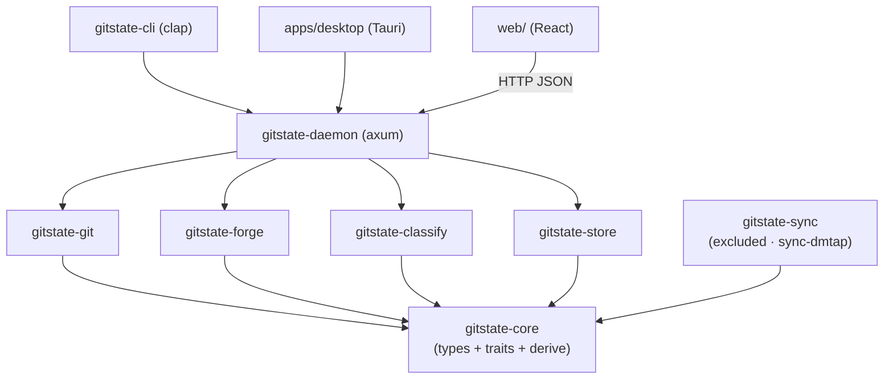

# Architecture

gitstate is a Rust Cargo workspace modeled on its vulos siblings (`slipscan`, `ofisi`): pure-domain
crates in the middle, I/O crates at the edges, and **one daemon** that serves both the Tauri desktop
shell and headless peers. This document is the living architecture contract — the normative interface
spec (crate APIs, daemon routes, CRDT semantics, taxonomy format, SQLite schema) that the parallel
build follows.

Workspace constants (inherited by every crate except the excluded sync crate):

```
version      = "0.1.0"
edition      = "2021"
rust-version = "1.85"
license      = "MIT OR Apache-2.0"
repository   = "https://github.com/vul-os/gitstate"
```

Product identifiers: Tauri `identifier = "org.vulos.gitstate"`, product name `gitstate`. CLI bin
`gitstate`; daemon bin `gitstated`. Default daemon port **7473** (`GITSTATE_PORT` / `GITSTATE_ADDR`).
Product slug `gitstate`, served at `gitstate.<vulos-domain>`.

## Crate map

| Crate | Role | Depends on |
|---|---|---|
| **gitstate-core** | Pure domain: types + the four traits + pure derivation helpers. No I/O. | — |
| **gitstate-git** | git2-rs: open/walk/diff, blame survival, SZZ bug-intro, project-state + six-dimension contribution derivation. | core |
| **gitstate-forge** | GitHub + GitLab via `gh`/`glab` (REST/GraphQL token fallback). | core |
| **gitstate-classify** | `Classifier`: local LLM (llmux/OpenAI-compatible) + signed taxonomy + heuristic + local personalization. | core, store |
| **gitstate-store** | rusqlite persistence: contexts, categories, derived caches, CRDT op log. | core |
| **gitstate-daemon** | axum: serves `web/dist` (SPA) + the JSON API. The headless always-on peer. | all above |
| **gitstate-cli** | clap CLI (`bin: gitstate`). | all above |
| **gitstate-sync** | P2P CRDT sync of contexts + categories. **Excluded** from the workspace; feature `sync-dmtap`. | core |



## The four traits (owned by gitstate-core)

- **`ForgeClient`** — `list_pull_requests`, `list_issues`, `list_reviews`, `resolve_slug`. Implemented
  by `GitHubClient`/`GitLabClient` (gitstate-forge).
- **`Classifier`** — `classify(items, taxonomy)` and `judge_effort(diffs)`, plus a `capability()`
  (`Llm` | `Heuristic`). Implemented by `LlmClassifier`/`HeuristicClassifier` (gitstate-classify).
- **`Store`** — repos, contributors, derived caches, contexts, categories, personalization feedback,
  a kv table, and the CRDT op log. Implemented by `SqliteStore` (gitstate-store).
- **`SyncEngine`** — `publish` / `merge` / `export_since` / `status` over `SyncOp`. Implemented by
  `CrdtSyncEngine` (gitstate-sync, opt-in).

Pure derivation helpers (`gitstate-core::derive`) are deterministic and I/O-free — `normalize_dim`,
`composite`, `quality_from`, `durability_ratio`, `merge_contributor_identities`, `is_test_path` — so
both the git engine and tests can rely on them.

## The domain: what gitstate derives

- **ProjectState** — head sha, open/merged/draft PRs, open/closed issues, in-progress/done, DORA
  cycle-time p50/p90 (first-commit→merge), and change-failure rate. Derived, never entered.
- **Contribution** — six normalized dimensions per contributor × repo × window: **shipped, review,
  effort, quality, ownership, durability** — plus the pre-normalization `DimensionRaw` evidence, an
  `agent_pct`, and a composite displayed as texture (never a rank). Normalization is *within the repo
  cohort*; a single-member cohort maps to 50.
- **WorkItem** — the unit fed to the classifier: a PR/issue/commit/review with title, body, labels,
  state, and touched files.
- **EffortEstimate** — judged diff-difficulty (1–13, fibonacci-ish), method (`LlmJudged` |
  `Heuristic`), rationale, confidence. Never a line count.
- **Context / Category** — the CRDT-backed, sharable units (see [P2P-CONTEXTS.md](P2P-CONTEXTS.md)).

## One daemon, two front doors

`gitstate-daemon` (axum) holds an `AppState` (store, forge registry, classifier, taxonomy, optional
sync engine, and the `web/dist` path) and exposes a router that serves the JSON API under `/api` with
everything else falling through to the static SPA (unknown non-`/api` path → `index.html`). CORS is
permissive for `localhost` origins only.

- **Headless** (`gitstate serve` / `gitstated`) binds a fixed port (default `127.0.0.1:7473`).
- **Desktop** (Tauri) calls `Daemon::serve_ephemeral` during `setup` — binds `:0`, then injects the
  chosen origin into the webview as `window.__GITSTATE_API__` so the React client resolves it
  synchronously. No domain logic crosses the IPC boundary; all data flows over HTTP to the same
  daemon. The only Tauri commands are `app_info`, `daemon_base_url`, and `open_external`.

`build_state_from_env()` is the single wiring both the daemon binary and the Tauri shell call.

### JSON API (selected)

All JSON, snake_case throughout (matching the domain serde). Errors are `{ "error", "code" }` with a
4xx/5xx status. Success bodies are the bare object/array.

| Method | Path | Purpose |
|---|---|---|
| GET | `/health` | `{ status, version, sync, classifier }` |
| GET/POST/DELETE | `/api/repos[/{id}]` | list / add (by `path` or `remote_url`) / remove |
| POST | `/api/repos/{id}/scan` | derive from git (+forge unless disabled) → `ScanResult` |
| GET | `/api/repos/{id}/project-state` | `ProjectState` |
| GET | `/api/repos/{id}/contributions?from=&to=` | `[Contribution]` |
| GET | `/api/repos/{id}/work-items?kind=&state=` | `[WorkItem]` |
| GET | `/api/contributors` | merged identities |
| GET/POST/GET/PATCH/DELETE | `/api/contexts[/{id}]` | CRUD (delete = tombstone) |
| GET/POST/PATCH/DELETE | `/api/categories[/{id}]` | CRUD (delete = tombstone) |
| POST | `/api/classify`, `/api/classify/feedback` | classify items / record a correction |
| POST | `/api/effort` | judge diff-difficulty |
| GET/POST | `/api/taxonomy`, `/api/taxonomy/verify` | the signed doc / verify a doc |
| GET/POST | `/api/sync/status`, `/api/sync/publish` | sync status / publish (`sync_disabled` when off) |

## web/ client contract

The React app is **kept** and repointed at the daemon. A single module `web/src/lib/api.js` owns
base-URL resolution and every typed call — **no component calls `fetch` directly**:

```js
export function resolveBaseUrl() {
  if (typeof window !== "undefined" && window.__GITSTATE_API__) return window.__GITSTATE_API__; // Tauri
  return "";  // headless: daemon serves the SPA same-origin → relative /api
}
```

So Tauri hits `http://127.0.0.1:<port>/api/...`; the daemon-served browser build uses same-origin
`/api/...`; a standalone `vite dev` sets `window.__GITSTATE_API__` to a locally-run `gitstated`. The
old multi-tenant `X-Org-ID`/JWT headers and the org/billing/invoice/capacity hooks are removed or
no-op'd — this is a single-user local app with no auth.

## Storage

`gitstate-store` persists to `<data_dir>/gitstate.db` (SQLite, WAL) with forward-only migrations under
`crates/gitstate-store/migrations/NNN_*.sql`, applied at `open()`. Tables cover repos, contributors,
a commit cache (**aggregates only — no source stored**), work items, derived project-state and
contributions, effort + classifications, the CRDT tables (contexts, `context_members`,
`context_field_clocks`, categories, `category_field_clocks`), the `sync_ops` op log, personalization
feedback, and a generic `kv`. The Rust migrations live **inside the store crate**, never at repo root,
so they don't collide with the kept Go `migrations/`.

## Classification &amp; the signed taxonomy

See [CLASSIFICATION-AND-TAXONOMY.md](CLASSIFICATION-AND-TAXONOMY.md). In brief: classification runs
locally (your LLM or a deterministic heuristic); label alignment across peers rides a versioned,
content-addressed, ed25519-signed taxonomy verified fail-closed against a pinned key; corrections
train a local personalization store.

## Peer-to-peer sync

See [P2P-CONTEXTS.md](P2P-CONTEXTS.md). Contexts and categories are CRDTs (LWW scalars + OR-Sets over
a hybrid logical clock); `SyncOp` is the transport-agnostic op envelope defined in core so the store
and the sync engine agree. `gitstate-sync` is excluded from the default workspace and behind the
`sync-dmtap` feature — a plain build has no P2P stack.

## Ownership (parallel build)

Disjoint write sets keep parallel agents collision-free: **rust-domain** owns the workspace manifest +
`gitstate-core`/`gitstate-classify`/`gitstate-store`; **rust-integration** owns
`gitstate-git`/`gitstate-forge`/`gitstate-daemon`/`gitstate-cli`/`gitstate-sync` + `apps/desktop`;
**web** owns `web/`; **narrative** owns the docs and license; **site** owns `site/`; **cloud-gh** owns
`.github/` and the vulos-cloud site registration. The domain crate's public API is the shared, read-only
contract; the legacy Go tree (`internal/`, `cmd/`, `migrations/`, `go.mod`, `go.sum`) is untouchable.
