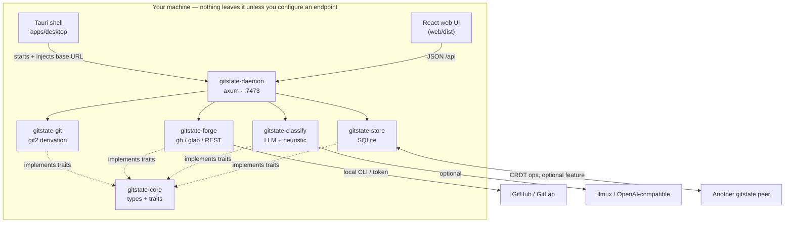

# Architecture

gitstate is a Rust **Cargo workspace** plus a Tauri desktop shell and a kept React frontend. It is
modeled on its VulOS siblings (slipscan, ofisi): a pure domain core, thin integration crates, one
SQLite file, and a daemon that serves the same UI whether you run it headless or inside the desktop
app.

---

## Crates

| Crate | Role |
|---|---|
| **gitstate-core** | Pure domain — no I/O. Types (`Repo`, `Commit`, `Contributor`, `WorkItem`, `ProjectState`, `Dimensions`, `Contribution`, `Context`, `Category`, `Taxonomy`), the four traits (`ForgeClient`, `Classifier`, `Store`, `SyncEngine`), deterministic derivation helpers, and the CRDT op envelope. |
| **gitstate-git** | git2-rs derivation engine — history walk, blame survival, SZZ bug-introduction linking, diff summaries, and the high-level `derive_project_state` / `derive_contributions`. |
| **gitstate-forge** | GitHub + GitLab clients that shell `gh` / `glab` (falling back to REST/GraphQL with a token). A local-repo scan makes no network calls. |
| **gitstate-classify** | `Classifier` implementations — a local LLM client and a deterministic heuristic — plus taxonomy verification and on-box personalization. |
| **gitstate-store** | rusqlite persistence for repos, caches, contexts, categories, and the CRDT op log. |
| **gitstate-daemon** | axum server — serves `web/dist` with SPA fallback and the JSON API. This is the headless always-on peer. |
| **gitstate-cli** | clap CLI (`gitstate`), wiring the same state the daemon uses. |
| **gitstate-sync** | P2P CRDT sync — **excluded from the default workspace** behind an optional `sync-dmtap` feature, so a bare `cargo build` never pulls P2P dependencies. |

---

## One API, two front ends

The daemon owns all domain logic and exposes it as JSON under `/api`. Both front ends are thin clients
over that one API:

- **Headless** — `gitstate serve` binds `127.0.0.1:7473`, serves `web/dist` same-origin, and answers
  `/api/*`. The React app uses relative URLs.
- **Desktop** — the Tauri shell starts the daemon on an *ephemeral* port during `setup`, injects the
  chosen origin into the webview as `window.__GITSTATE_API__`, and loads the same `web/dist`. No domain
  logic crosses the Tauri IPC boundary — everything flows over HTTP to the in-process daemon.

This is why the frontend is **kept as React**: the app already had one, and both delivery modes reuse
it verbatim. See the [HTTP API](api.md) for the full endpoint list.

---

## Data location

Everything lives in one SQLite database (WAL mode) under your platform data directory — e.g.
`~/Library/Application Support/gitstate/gitstate.db` on macOS, `~/.local/share/gitstate/` on Linux.
Override with `--data-dir` or `GITSTATE_DATA_DIR`. Only aggregates are stored: commit line counts and
summaries, never source code.

---

## What was removed

The previous gitstate was a Go + React + Postgres multi-tenant SaaS with a commercial EE tier. The
transform kept the *essence* — derive truth from git — and flipped the delivery:

- No multi-tenant server, no Postgres, no billing-collection cloud, no org/seat model.
- The Go `internal/` and `cmd/` trees remain in-tree, untouched, for a staged port — they are not built
  by the Rust workspace.
- Licensing moved from AGPL-3.0 + a commercial EE tier to the suite standard **MIT OR Apache-2.0**.

Next: [Derivation model](derivation.md) · [Contexts & P2P sync](contexts-sync.md)
