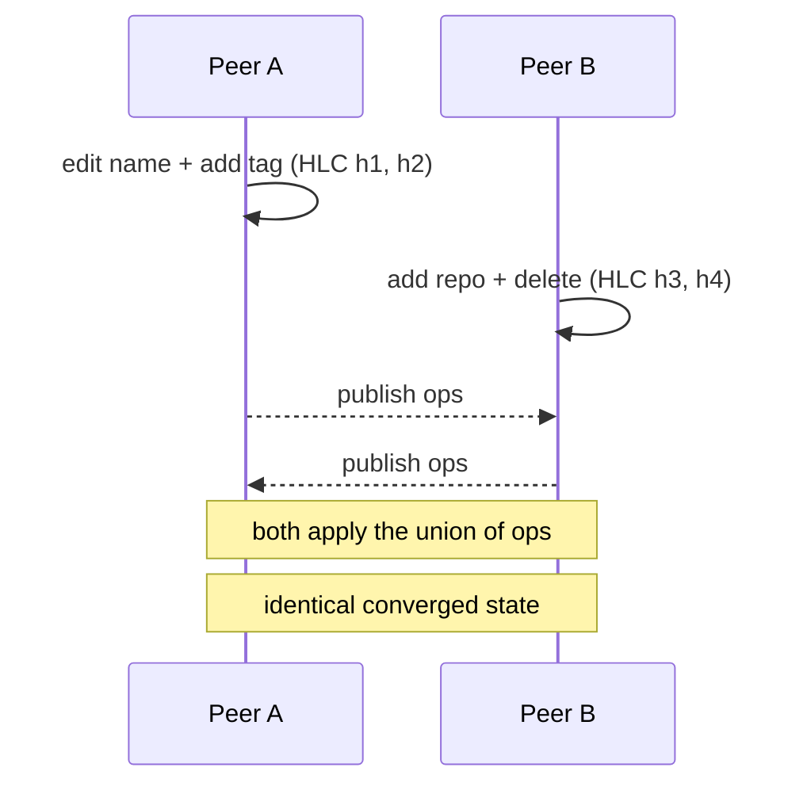

# Contexts & P2P sync

A **context** is a saved working set — a named bundle of repos, pull requests, tags, and notes. It's
the unit you share. Contexts and your category tree converge **peer-to-peer** over a CRDT op log, with
no central server to merge through.

---

## Contexts

```json
{
  "id":"…", "name":"Q3 storage refactor",
  "description":"Migrate the store seam to WAL + tighten the CRDT op log.",
  "repo_ids":["…"],
  "pr_refs":[{ "repo_slug":"vul-os/gitstate","number":412,"note":"the seam PR" }],
  "notes":"free-form text", "tags":["refactor","storage"],
  "created_at":"…", "updated_at":"…"
}
```

Create, edit, and delete them in the UI, via the [HTTP API](api.md) (`/api/contexts`), or from the
[CLI](cli.md) (`gitstate context …`). Export any context to a portable JSON file and import it
elsewhere — a working set travels without a server.

---

## The CRDT model

Both contexts and categories are backed by an **operation log**. Every local edit is decomposed into a
minimal set of ops, each stamped with a **hybrid logical clock** (HLC) `{ wall_ms, counter, peer }`.
Local edits and remote merges share one code path, so state is identical however ops arrive.

| Data | Merge rule |
|---|---|
| Scalars — `name`, `description`, `notes`, category `label` / `color` / `parent_key` | **Last-writer-wins** by per-field HLC. |
| Sets — `tags`, `repo_ids`, `pr_refs` | **OR-Set**, add-wins on a tie. An element is present iff its add-HLC > its remove-HLC. |
| Deletion | Document-level tombstone with its own HLC; a later higher-HLC edit **resurrects** the doc. Tombstones are retained so late peers still converge. |

`pr_ref` element identity is `(repo_slug, number)`; its `note` is an LWW scalar on the element.

**Convergence guarantee:** op application is commutative and idempotent — replaying the op log in any
order yields identical state. `updated_at` is the max HLC wall-time rendered as RFC3339.



---

## Transport is optional

The op log lives in SQLite regardless. **Actual peer-to-peer transport is an optional feature**
(`sync-dmtap`) provided by the excluded `gitstate-sync` crate — a bare `cargo build` never pulls the
P2P dependencies. When it isn't built:

- `GET /api/sync/status` returns `{ "enabled": false, … }`.
- `POST /api/sync/publish` returns `404` with `{ "code":"sync_disabled" }`.

Everything else — creating, editing, exporting, importing contexts and categories — works fully
offline. Sync is how two of *your* devices (or a trusted peer) converge; it is never required to use
the app.

---

## What is deliberately *not* built

Cross-population features — trending contexts, "others tagged this", "similar repos" — would require a
view of strangers you'll never meet, so they need a coordinator. gitstate leaves only a **dormant,
optional coordinator seam** and builds none of it. Anti-spam/sybil tiers and pooled-feedback
fine-tuning are likewise omitted: they are a tax on an unbuilt discovery layer. The rule: only "needs a
view of strangers" belongs to an optional coordinator; everything a git tool is actually for is local
+ P2P.

Next: [Signed taxonomy](taxonomy.md) · [HTTP API](api.md)
