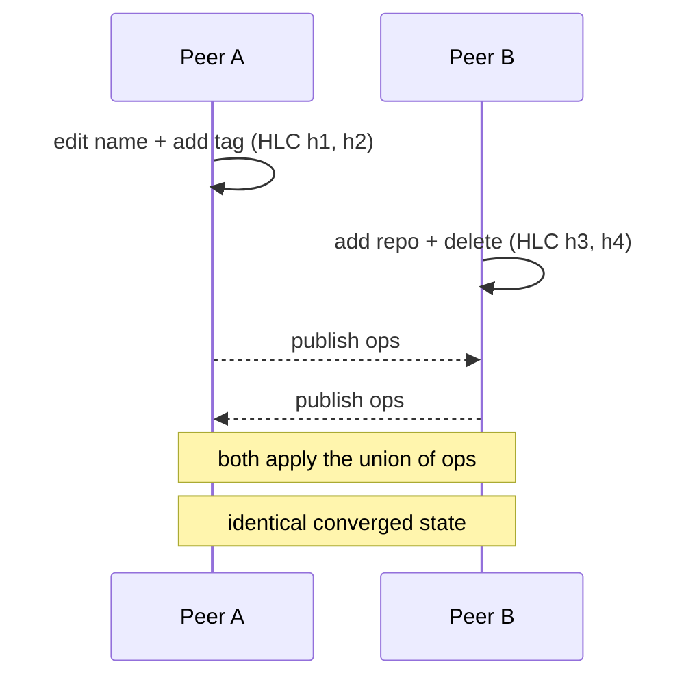

# Contexts & P2P sync

A **context** is a saved working set — a named bundle of repos, pull requests, tags, and notes. It's
the unit you share. Contexts and your category tree converge **peer-to-peer** over a CRDT op log, with
no central server to merge through.

---

## Contexts

```json
{
  "id":"…", "name":"Q3 storage refactor",
  "description":"Migrate the store seam to WAL + tighten the CRDT op log.",
  "repo_ids":["…"],
  "pr_refs":[{ "repo_slug":"vul-os/gitstate","number":412,"note":"the seam PR" }],
  "notes":"free-form text", "tags":["refactor","storage"],
  "created_at":"…", "updated_at":"…"
}
```

Create, edit, and delete them in the UI, via the [HTTP API](api.md) (`/api/contexts`), or from the
[CLI](cli.md) (`gitstate context …`). Export any context to a portable JSON file and import it
elsewhere — a working set travels without a server.

---

## The CRDT model

Both contexts and categories are backed by an **operation log**. Every local edit is decomposed into a
minimal set of ops, each stamped with a **hybrid logical clock** (HLC) `{ wall_ms, counter, peer }`.
Local edits and remote merges share one code path, so state is identical however ops arrive.

| Data | Merge rule |
|---|---|
| Scalars — `name`, `description`, `notes`, category `label` / `color` / `parent_key` | **Last-writer-wins** by per-field HLC. |
| Sets — `tags`, `repo_ids`, `pr_refs` | **OR-Set**, add-wins on a tie. An element is present iff its add-HLC > its remove-HLC. |
| Deletion | Document-level tombstone with its own HLC; a later higher-HLC edit **resurrects** the doc. Tombstones are retained so late peers still converge. |

`pr_ref` element identity is `(repo_slug, number)`; its `note` is an LWW scalar on the element.

**Convergence guarantee:** op application is commutative and idempotent — replaying the op log in any
order yields identical state. `updated_at` is the max HLC wall-time rendered as RFC3339.


```mermaid
sequenceDiagram
  participant A as Peer A
  participant B as Peer B
  A->>A: edit name + add tag (HLC h1, h2)
  B->>B: add repo + delete (HLC h3, h4)
  A-->>B: publish ops
  B-->>A: publish ops
  Note over A,B: both apply the union of ops
  Note over A,B: identical converged state
```

---

## Transport: HTTP to an address you typed

The peer transport is compiled in — there is **no build feature to enable** — and it is inert until an
operator enrols a peer. There is no discovery of any kind: no directory, no default endpoint, no seed
list, no mDNS, and no rendezvous or hole-punching broker in any path, default or fallback. An empty
peer list means this node replicates with nobody, which is correct for a fresh install rather than
degraded.

```bash
gitstate sync identity                       # on each node; hand the pair over out of band
gitstate sync peer add --id <id> --url https://gitstate.example.org --key <hex>
gitstate sync run                            # push, then pull
```

A node with no routable address cannot be *dialled* — that is IP, not a missing feature — but both
directions of a round travel over the connection the caller opens, so a laptop behind NAT converges
fully with a node that has an address. Giving one side an address is what
[Deployment](deployment.md) is for.

### What authenticates what

- Every op carries its **author's own ed25519 signature** and is verified on its own. Ops are relayed,
  so a node re-exports changes it did not write; the original signature travels with the op rather than
  being replaced hop by hop, so a three-node topology does not require trusting the middle node.
- Admission is the **enrolled key**, not a valid signature. A stranger's own valid signature is refused.
- An op is refused if its clock's tiebreak identity is not the enrolled id of the key that signed it,
  or if its clock is more than 120 s in the future.
- Each request carries a **single-use** signed token over the method, path and timestamp; the responder
  signs the response body so the caller can confirm which node answered.
- Every failure is one `401` with no detail.

`GET /api/sync/status` always answers. Everything else — creating, editing, exporting, importing
contexts and categories — works fully offline; replication is how two of *your* nodes converge and is
never required to use the app.

### What it does not give you

The transport authenticates both ends and every op over plain HTTP, but does **not encrypt**. On an
`http://` peer URL your context names, notes and tags are readable in flight. gitstate does not
terminate TLS; put a reverse proxy in front of a node reachable over the internet — see
[Deployment](deployment.md).

---

## What is deliberately *not* built

Cross-population features — trending contexts, "others tagged this", "similar repos" — would require a
view of strangers you'll never meet, so they need a coordinator. gitstate leaves only a **dormant,
optional coordinator seam** and builds none of it. Anti-spam/sybil tiers and pooled-feedback
fine-tuning are likewise omitted: they are a tax on an unbuilt discovery layer. The rule: only "needs a
view of strangers" belongs to an optional coordinator; everything a git tool is actually for is local
+ P2P.

Next: [Signed taxonomy](taxonomy.md) · [HTTP API](api.md)
